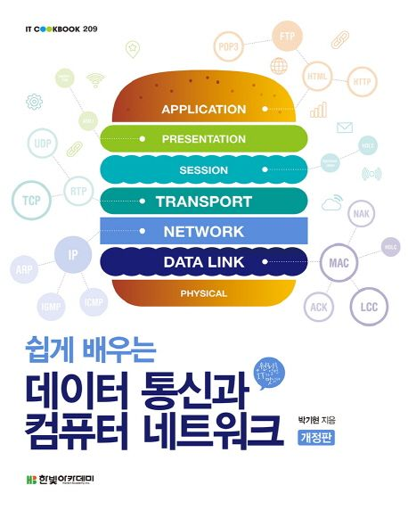
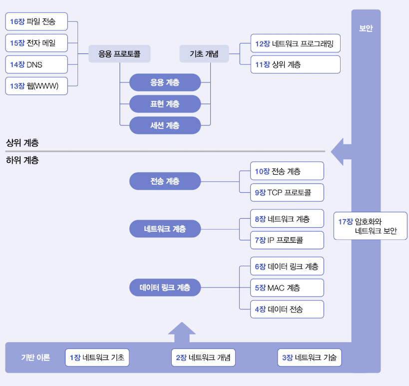

  
<h1 align="center">
  
쉽게 배우는 데이터 통신과 컴퓨터 네트워크

  
</h1>
  
  
<b>박기현 저</b> 
한빛아카데미 · 2022년 6월 28일 발행(전자책 3판)</b> 

## :bulb: 목표

- **네트워크 기반 이론을 이해한다**

  > 컴퓨터 네트워크 기본 원리와 구조를 이해한다. 특히, OSI 7계층 모델의 구조를 통해 표준 통신 모델의 원리를 학습한다.

- **OSI 계층 이해**

  > 통신 모델이 어떤 계층으로 구성이 되어 있고 어떤 역할을 맡는지 이해한다.

- **네트워크 서비스를 이해한다**

  > 인터넷에서 사용하는 각종 통신 프로토콜의 원리를 이해한다.(특히 웹 DNS, 전자 파일, 파일 전송 프로토콜 구조와 동작 방식 등)

- **네트워크 보안을 이해한다**

  > 암호화 시스템의 기본 구조와 원리를 학습하고, 보안과 관련해 다양한 이슈를 살펴본다.

 

## :mag: 목차

Chapter 01 네트워크 기초

  01 용어의 정의

  02 구조적 모델

  03 주소의 표현

Chapter 02 네트워크 개념

  01 프로토콜의 이해

  02 OSI 7계층 모델

  03 인터넷 모델

Chapter 03 네트워크 기술

  01 라우팅 기능

  02 네트워크의 분류

  03 인터네트워킹

  04 서비스 품질

Chapter 04 데이터 전송

  01 전송 방식

  02 오류 제어

  03 프레임 구조

  04 오류 검출 기법

Chapter 05 MAC 계층

  01 IEEE 802 시리즈

  02 CSMA/CD

  03 토큰 버스

  04 토큰 링

Chapter 06 데이터 링크 계층

  01 프로토콜의 기초

  02 슬라이딩 윈도우 프로토콜

  03 HDLC 프로토콜

Chapter 07 IP 프로토콜

  01 네트워크 계층의 기능

  02 라우팅 프로토콜

  03 IP 프로토

Chapter 08 네트워크 계층

  01 IPv6 프로토콜

  02 이동 IP 프로토콜

  03 제어용 프로토콜

Chapter 09 TCP 프로토콜

  01 전송 계층의 기능

  02 TCP의 헤더 구조

  03 TCP의 동작 원리

Chapter 10 전송 계층

  01 UDP 프로토콜

  02 RTP 프로토콜

  03 OSI TP 프로토콜

Chapter 11 상위 계층

  01 상위 계층의 이해

  02 세션 계층

  03 표현 계층

  04 응용 계층

Chapter 12 네트워크 프로그래밍

  01 소켓의 주소 체계

  02 소켓 시스템 콜

  03 클라이언트ㆍ서버 프로그래밍

Chapter 13 웹

  01 웹의 구조

  02 HTML의 기초

  03 HTTP 프로토콜

  04 CGI

Chapter 14 DNS

  01 주소의 변환

  02 네임 스페이스

  03 네임 서버와 해석기

  04 DNS 프로토콜

Chapter 15 전자 메일

  01 사용자 환경

  02 시스템 구조

  03 SMTP 프로토콜

  04 POP 서비스

Chapter 16 파일 전송

  01 FTP 응용 프로그램

  02 FTP 프로토콜

  03 TFTP 프로토콜

Chapter 17 암호화와 네트워크 보안

  01 암호화의 이해

  02 암호화 시스템

  03 보안 프로토콜

 