# 네트워크 기초

---

# 01 용어 정의

## 01-1 네트워크 기초 용어

**네트워크**란 하드웨어적인 전송 매체(Transmission Media)를 매개로 서로 연결되어 데이터를 교환하는 시스템(System)의 모음이다. 이 시스템과 전송 매체가 서로 연결되는 지점의 규격이 **인터페이스**(Interface)이다. 또한 시스템이 데이터를 교환할 때는 소프트웨어적으로 동작하는 통신 규칙인 **프로토콜**(Protocol)이 필요하다.

> 전송 매체는 동축 케이블을 포함하여, 공기, 무선 신호 등 다양하게 존재한다.

인터페이스와 프로토콜은 서로 다른 시스템을 상호 연동해 동작시키기 위해서 꼭 필요하다. 이를 표준화(Standardization)라고 한다.

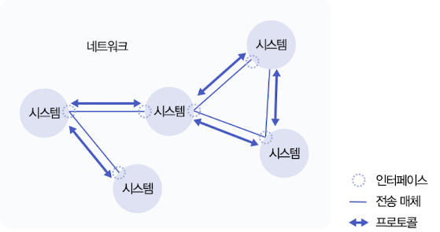

시스템은 반드시 일반 컴퓨터일 필요는 없고, 보통 컴퓨팅 기능을 보유한 네트워크 장비를 사용한다. 네트워크 가장 바깥쪽에 스마트폰을 포함해 일반 사용자들의 컴퓨터가 연결되어 데이터 교환을 한다.

인터넷은 IP(Internet Protocol)라는 네트워크 프로토콜이 핵심 역할을 하는 네트워크의 집합체다. IP란 단어 자체에 프로토콜이 포함되어 있지만, 보통 IP 프로토콜이라 부른다.

### 시스템

내부 규칙에 따라 자율적으로 동작하는 대상을 뜻한다. 하드웨어적으로 자동차, 자판기, 컴퓨터, 마이크로프로세서, 하드디스크 등을 의미하면, 소프트웨어적으로는 신호등 운영 시스템, MS와 같은 운영체제, 프로세스 등을 의미한다.

### 인터페이스

> 인터페이스는 시스템과 시스템을 연결하기 위한 표준화된 접촉 지점이다. 따라서 하드웨어적인 관점도 존재한다. 예를 들어 컴퓨터 본체와 키보드 등을 연결하기 위해, RS-232C, USB 등과 같은 논리적인 규격과, 잭의 크기와 모양 같은 물리적인 규격도 표준화가 필요하기 때문이다.

인터페이스의 소프트웨어적인 예를 들면, 프로그래밍 언어에서 함수 설계자는 함수 이름과 매개변수를 표준화해서 정의해야 한다. 정의에 맞게 함수 이름과 인수를 지정해서 사용해야 하는 것이다.

### 프로토콜

논리적으로 상호 연동되는 시스템이 전송 매체를 통과해서 데이터를 교환할 때는 표준화된 규칙을 따른다. 이 규칙이 바로 프로토콜이다. 일반적으로 프로토콜은 상하 관계가 아닌 동등한 위치에 있는 시스템 사이의 규칙이라는 측면이 강조되어 인터페이스(인터페이스는 특히 두 시스템이 연동되기 위한 특정한 접촉 지점을 의미하는 경우가 많다.)와 구분된다.

### 네트워크

통신용 전송 매체로 연결된 여러 시스템이 프로토콜을 사용해서 데이터를 주고 받을 때, 이들을 하나의 단위로 통칭하여 네트워크(Network)라고 부른다. 네트워크끼리는 라우터(Router)라는 중개 장치를 사용하여 연결한다.

### 인터넷

전 세계 모든 네트워크가 유기적으로 연결되어 동작하는 통합 네트워크다. 시스템, 인터페이스, 전송 매체, 프로토콜들은 그 종류가 매우 다양하지만, **데이터 전달 기능**에 한해서는 공통으로 IP 프로토콜을 사용한다.

인터넷이라는 용어 자체가 IP(Internet Protocol)의 첫 단어인 Internet에서 유래했다.

---

## 01-2 시스템 기초 용어

네트워크를 구성하는 시스템이 반드시 일반 컴퓨터처럼 복잡한 기능을 수행해야 하지는 않는다. 하지만 어느 정도 데이터 전송 기능과 같은 특정한 컴퓨팅 기술은 가지고 있다. 이런 수행 기능에 따라 시스템을 다양한 명칭으로 부른다.

### 노드

노드(Node)는 컴퓨터 이론 분야에서 특정 시스템을 가리키는 가장 일반적인 용어다.(포괄적이다.) 네으퉈크적으로는 데이터를 주고받을 수 있는 모든 시스템을 통칭한다. 노드는 라우터(인터넷 내부를 구성하는)와 호스트(인터넷 바깥쪽에서 데이터를 주고받는)로 구분된다.

### 라우터

인터넷 내부를 구성하며, 데이터 전송 기능을 포함한다. 인터넷 바깥쪽에 연결된 호스트 사이의 데이터 전송을, 최적의 경로를 통해 이루어지도록 만든다.

### 호스트

인터넷 바깥쪽에 연결되어, 일반 사용자들의 '네트워크 접속 창구' 역할을 한다. 기능(서비스)을 기준으로 클라이언트와 서버로 나눌 수 있다. 서비스 단위로 개념을 나누기 때문에 임의의 호스트가 하나로 고정되지 않고, 클라이언트가 될 수도 있고 서버가 될 수도 있다.

* 클라이언트(Client)는 임의의 인터넷 서비스를 '이용하는' 응용 프로그램을 나타낸다. 

* 서버(Server)는 서비스를 '제공하는' 응용 프로그램을 뜻한다.

호스트 단위로도 클라이언트와 서버 용어를 사용하기도 한다. 예를 들어 다양한 서비스를 제공하는 데 특화된 호스트 자체를 서버라고 부르기도 한다. 클라이언트의 요청이 있을 때마다 서비스를 반복해서 제공한다.

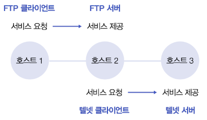

위 이미지는 FTP(File Transfer Protocol)로 원격 호스트 끼리의 파일 송수신을 제공하는 서비스, 텔넷(Telnet)으로 원격 호스트에 로그인하는 서비스를 나타내고 있다. 호스트 2가 FTP 서비스를 제공하고, 호스트 3가 텔넷 서비스를 제공한다.

1. 호스트 1이 호스트 2에 FTP 서비스를 요청한다. 즉, FTP 서비스를 기준으로 호스트 1은 클라이언트, 호스트 2는 서버다.

2. 호스트 2는 호스트 3에 텔넷 서비스를 요청한다. 즉, 텔넷 서비스를 기준으로 호스트 2는 클라이언트, 호스트 2는 서버다.

이런 과정을 보면 호스트 2는 클라이언트가 되기도, 서버가 되기도 한다.

---

# 02 구조적 모델

컴퓨터 네트워크는 외형상 호스트 시스템과 전송 매체로 구분한다. 하지만 내부 기능을 기초로 해서 다양한 구조로도 세분화할 수 있다. 특히, 호스트가 제공하는 복잡한 네트워크 기능을 특정 그룹으로 묶어 계층 모델로 설명할 수 있다.

## 02-1 OSI 7계층 모델

여러 시스템을 서로 연결해서 통신하려면, 시스템 구조를 표준화해야 한다. 국제 표준화 단체인 ISO에서 OSI(Open Systems Interconnection) 7계층 모델을 제안했다.

### 계층 구조

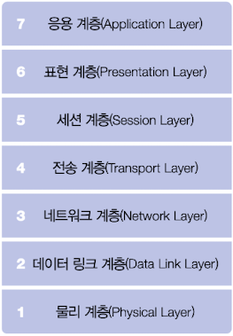

네트워크에 연결된 호스트는 위와 같은 7개 계층으로 모듈화된 전송 기능을 갖춰야 한다.

* 일반 사용자들은 OSI 7계층 맨 위에 있는 응용 계층에서 데이터 송수신을 요청한다.(송신 호스트가 데이터를 송신한다.)

* 이 요청이 하위 계층에 순차적으로 전달되며 맨 아래에 있는 물리 계층을 통해 상대 호스트에 전송된다. 그리고 요청이 각 계층으로 전달되는 과정에서, 계층별로 자신이 담당하는 기능을 수행하며 데이터를 안전하게 전달한다.(이 과정에서 송수신 호스트 사이의 라우터들이 중개 기능을 수행한다. 일반적으로 라우터는 하위 3개 계층의 기능만 수행한다.)

* 수신 호스트가 데이터를 받을 때는 물리 계층부터 역순으로 순차적으로 올라오며 응용 계층까지 도달해서 받게 된다. 수신 호스트가 그 데이터를 처리해서 결과 데이터를 보내면 전체 순차적인 절차를 다시 한 번 밟게 된다.

### 계층별 기능

1. 물리 계층: 크게 유선 매체와 무선 매체로 나뉜다. 호스트를 전송 매체로 연결하기 위해 인터페이스 규칙과 전송 매체의 특성이 중요하다.

2. 데이터 링크 계층: 물리 계층에서 데이터를 전달하면서 잡음(Noise)와 같은 외부 요인을 제어하는 기능(Error Control)을 수행한다. 이를 위해 오류 발생 사실을 인지하는 기능과, 오류 복구 기능을 갖추고 있다. 일반적으로 컴퓨터 네트워크에서 오류 복구는 원래 데이터를 재전송(Retransmission)하는 방식으로 처리한다. 

3. 네트워크 계층: 송신 호스트가 전송한 데이터는 수신 호스트에게 안전하게 도착하기 위해 여러 개의 중개 시스템인 라우터를 거친다. 이 과정에서 데이터가 올바른 경로를 선택할 수 있도록 지원하는 계층이 바로 네트워크 계층이다. 만약 네트워크 부하가 증가하면 특정 지역에 혼잡(Congestion)이 발생할 수 있는데, 이런 혼잡을 제어(Congestion Control)도 네트워크 계층이 담당한다.

4. 전송 계층: 상기한 과정대로 데이터를 교환하는 최종 주체는 호스트가 아니고, 호스트 내부에서 실행되는 응용 네트워크 프로세스다. 네트워크 계층이 데이터가 올바른 경로를 가도록 지원하기는 하지만, 응용 프로세스까지 전달하는 기능은 없다. 그렇기 때문에 송신 프로세스와 수신 프로세스 간의 연결 기능을 지원하는 전송 계층이 존재한다. (사실상 데이터가 전송되는 최종 경로의 양 끝단 사이에 위치한 계층이다. 계층 4까지는 운영체제에서 시스템 콜 형태로 상위 계층에 제공하며, 계층 5~7은 응용 프로그램으로 작성되기 때문이다.)

↑하위 계층

---

↓상위 계층

5. 세션 계층: 전송 계층과 유사하지만, 더 상위의 논리적 연결이다. 세션 연결은 응용 환경에서 사용자 간 대화(Dialog) 형태로 연결을 지원한다. 예를 들어, 인터넷에서 파일을 송수신하던 도중에 연결이 끊기면 이는 전송 계층에서 연결이 종료된 것이다. 하지만 이후 데이터 송수신이 멈춘 지점부터 이어서 전송하는 기능은 세션 기능이 지원한다.

6. 표현 계층: 전송되는 데이터의 의미(Semantic)를 잃지 않도록 올바르게 표현(Syntax)하는 방법을 다룬다. 즉, 정보를 교환하는 호스트들이 표준화된 방법으로 데이터를 인식할 수 있도록 만든다. 또한 본래 기능에 더해서, 압축과 암호화하는 기능도 다루고 있다.(동영상과 같은 대용량 데이터를 압축해서 전송 데이터 양을 줄이는 등)

7. 응용 계층: 일반 사용자들은 위한 다양한 네트워크 응용 서비스를 지원한다.

### 프로토콜과 인퍼테이스

호스트끼리 통신하는 과정에서는 각 계층의 모듈이 상대 호스트의 동일 계층과 개별적으로 논리적 통신을 수행해야 한다. 예를 들어 통신 양단에서 한쪽 호스트의 계층 n 모듈은, 상대 호스트의 계층 n 모듈과 통신한다. 이와 같이 각 계층은 정해진 방식과 절차에 따라 상대 게층과 통신하는데, 이 과정에서 필요한 규칙이 바로 프로토콜이다.

상하위 계층 간에는 인터페이스(Interface)라는 규칙이 존재하고, 하위 계층이 상위 계층에 제공하는 인터페이스를 특별히 서비스(Service)라고 부른다. 

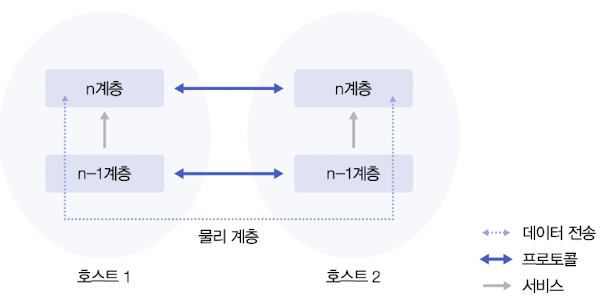

한 호스트를 기준으로 데이터 전송은 위아래 양방향으로 모두 가능하다. 두 호스트 기준에서는 좌우 양방향으로 모두 가능하다. 하지만, 좌우 간의 물리적인 데이터 전송은 반드시 가장 아래의 물리 계층을 통해 이뤄진다.

그림에서 호스트 1과 호스트 2의 계층 n 프로토콜이 서로 통신하려면, 계층 n-1 프로토콜의 서비스가 필요하다. 즉, 계층 n이 상대 호스트의 계층 n에 데이터를 전송하는 과정은 하위 n-1 계층을 통해 진행된다.

### 인터넷의 계층 모델

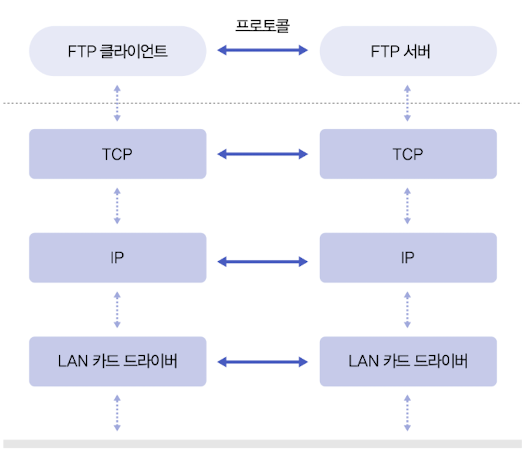

위 그림은 FTP 프로그램을 이용하는 경우의 인터넷 계층 구조를 나타낸다. IP가 네트워크 계층(3) 기능을 수행하며, TCP(Transmission Control Protocol)와 UDP(User Datagram Protocol)는 전송 계층(4)의 기능을 수행한다. 전송 계층 이하의 프로토콜은 호스트의 운영체제 내부에서 구현되며, FTP, 텔넷, 전자 메일 등과 같은 응용 프로그램은 사용자 프로그램 환경에서 계층 5~7이 합쳐져 구현된다.

FTP 클라이언트가 FTP 서버에 데이터를 전송하는 과정은 다음과 같다. 

1. FTP 클라이언트가 FTP 서버에 직접 데이터를 전송하는 것은 불가능하므로, 먼저 자신의 하위 TCP에 데이터를 보낸다.

2. TCP에 보내진 데이터는 IP 프로토콜과 LAN 카드를 거쳐 이더넷으로 표현된 전송 매체를 통해 FTP 서버의 LAN 카드로 전달된다.

3. FTP 서버에 도착한 데이터는 송신 순서의 반대 과정을 거친다. LAN 카드, IP 프로토콜, TCP 프로토콜을 거쳐서 FTP 서버 프로그램에 도착한다.

물론 양방향 통신이므로, 반대 방향의 전송도 가능하다.

## 02-2 인터네트워킹

네트워크와 네트워크의 연결을 인터네트워킹이라 한다. 

### 네트워크의 연결

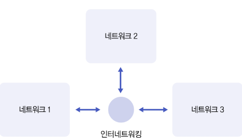

서로 독립적으로 운영되는 2개 이상의 네트워크가 연동되어 서로 정보를 교환하기 위해서는, 데이터를 중개하는 인터네트워킹 시스템이 필요하다. 물리적으로 연결될 뿐만 아니라, 데이터 중개에 필요한 상위의 네트워크 프로토콜들이 지원되야 한다.

인터네트워킹 시스템의 주요 기능은 전송 데이터의 경로 선택과 관련이 깊다. 예를 들어 그림은 네트워크 1에서 유입된 데이터를 네트워크 2와 네트워크 3 중 누구에게 보낼 것인가를 선택해야 한다.(3. 네트워크 계층 기능) 인터네트워킹 시스템은 네트워크 계층을 포함한 하위 3개 계층의 기능을 수행한다.

인터네트워킹 시스템에 연결된 네트워크들이 물리적으로 같은 종류가 아니어도 된다. 그렇다는 말은 반대로 인터네트워킹 시스템은 모든 네트워크에 대해 물리적이고 논리적인 인터페이스를 지원해야 한다. 모든 네트워크와 개별적으로 연동할 수 있어야 하기 때문에, 양쪽 프로토콜이 서로 일치하지 않으면 변환 작업도 수행해야 한다.

### 게이트웨이

인터네트워킹을 수행하는 시스템을 일반적으로 게이트웨이(Gateway)라고 부른다. 일반적으로 기능의 한계에 따라 리피터, 브리지, 라우터 등으로 나뉜다.

* 리피터: 물리 계층의 기능을 지원한다. 예를 들어 물리 신호는 전송 거리가 멀수록 감쇄되므로 이를 보완해주어야 한다. 리피터는 단순히 물리적으로 신호를 증폭하여 다른 쪽으로 중개하는 역할을 한다.

* 브리지: 리피터가 단순히 신호를 증폭시킨다면, 브리지는 리피터 기능에, 데이터 링크 계층 기능(2)을 추가한 것이다. 물리 계층에서 발생한 오류를 해결한다. 가정에서 사용하는 무선 공유기가 바로 유무선 기능을 모두 지원하는 브리지의 예시다.

* 라우터: 라우터는 물리 계층, 데이터 링크 계층, 네트워크 계층 기능을 지원한다. 어느 네트워크로 데이터를 전달할지 판단하며, 어느 경로가 더 빠른 데이터 전송을 지원하는지도 판단한다. 네트워크와 호스트와 관련된 정보는 일반적으로 라우팅 테이블(Routing Table)에 보관된다.

### 프로토콜

프로토콜은 통신 시스템이 데이터를 교환하기 위해 사용하는 통신 규칙이다. 각 계층마다 프로토콜이 존재한다. 계층 1은 계층 1끼리 통신할 수 있는 프로토콜이 존재하고, 계층 2는 계층 2끼리 통신할 수 있는 프로토콜이 존재한다.

다음은 일반인이 스마트폰으로 통화할 때의 규칙이다. 이런 순서와 절차도 프로토콜이다. 시간은 위에서 아래로 흐르고, 왼쪽의 발신자가 오른쪽의 수신자에게 통화를 시도한다.

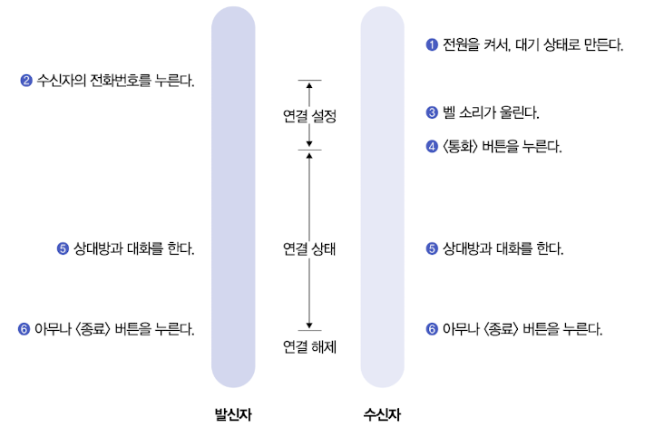

연결을 설정할 떄는 항상 발신자의 요청에 의해 시작되며, 수신자는 미리 연결 대기 상태에 있어야 한다. 연결 설정은 상호 간의 합의 아래 이루어지지만, 종료는 한쪽의 일방적인 종결 선언으로도 가능하다.

### 데이터 단위

네트워크 프로토콜을 사용해 데이터를 교환할 때는 먼저 데이터를 특정 형태로 규격화하는 작업이 필요하다. OSI 7계층 모델의 각 계층에서 규격화된 데이터는 각각 고유 명칭이 있다.(계층에 상관없이 PDU(Protocol Data Unit)으로 통칭할 수도 있다.)

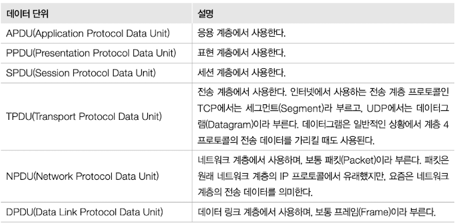

특이 이중에서도 네트워크 계층에서 정의된 패킷(Packet)이 인터넷에서 가장 많이 인용되며, 데이터 링크 계층에서 사용하는 프레임(Frame)도 자주 인용된다. 전송 계층에서 정의된 데이터그램(Datagram)도 가상 회선이라는 용어와 대비되면서 중요하게 다루어지기 때문에 익숙해질 필요가 있다.

---

# 03 주소의 표현

시스템은 기능과 목적과 함께 고유의 구분자(Identifier)가 필요하다. 인터넷에서 일반 사용자는 문자로 된 이름을 사용하고, 인터넷 내부는 숫자로 된 주소를 사용한다. 둘 사이의 변환 기능을 통해 1:1 관계로 이어진다. 

구분자는 일반적으로 다음 네 가지 특징을 가진다.

1. 유일성: 다만 이론적으로 완벽하게 유일성을 보장하기는 불가능하다.

2. 확장성: 이용자가 늘면서 필요한 구분자 양도 늘어난다. 처음 인터넷이 만들어질 때 이 정도로 이용자가 많을 것이라 예상하지 못한 탓에 IP 주소도 고갈 문제에 직면해 있다.

3. 편리성: 구분자는 시스템의 내부 처리 구조를 효율적으로 운용할 수 있도록 도와야 한다. 일반인이 이해할 수 있도록 숫자로 된 주소와 문자로 된 이름을 매핑하는 기능을 가진다.

4. 정보의 함축: 구분자는 응용 환경에 적절하게 대응할 수 있는 다양한 부가 정보를 지니고 있다.

## 03-1 주소와 이름

네트워크에는 여러 종류의 주소와 이름이 존재한다. 이는 각 계층의 기능을 담당하는 프로토콜마다 주소를 독립적으로 관리하기 때문이다. 예를 들어, IP 프로토콜은 호스트를 구분하기 위해 IP 주소를 사용하며, 데이터 링크 계층에서는 LAN 카드별로 MAC 주소를 따로 부여한다. 전송 계층을 수행하는 TCP에서는 호스트에서 수행되는 네트워크 프로세스마다 별도의 포트(Port) 주소를 할당하고 관리한다.

### IP 주소

네트워크 계층 기능을 수행하는 IP 프로토콜이 호스트를 구분하기 위해 사용하는 주소 체계다. 임의의 호스트를 인터넷에 연결하려면 반드시 IP 주소를 할당받아야 한다.

IP 주소는 32비트 이진 숫자로 구성되는데, 보통 8비트씩 네 부분으로 나눠 십진수로 표현한다. 

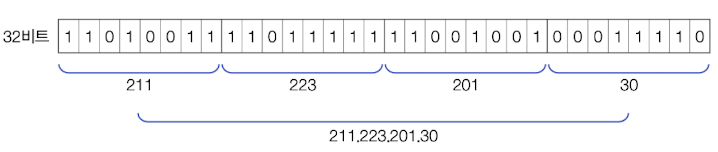

일반 사용자들이 이진수에 익숙하지 않고, 길이도 너무 길어지기 때문에 이들을 십진수로 변환해서 각각을 점(.)으로 구분한다.(221.223.201.30) 이조차도 주소로 외우기 힘들기 때문에, 문자로 된 도메인 이름을 사용한다.(www.korea.co.kr)

IP 주소는 유일성을 보장하기 위해서 국제 표준화 기구가 전체 주소를 관리하고 할당하고 있다. 따라서 중복 주소의 사용을 원천적으로 차단하고 있다. 하지만 32비트의 크기 제한 때문에 확장성에 많은 문제가 생겼으며, 이를 해결하기 위해 새로운 프로토콜인 IPv6(Internet Protocol Version 6)에서 주소 표현 공간을 128비트로 확장했다. 이 현재의 IP 프로토콜과 구분하기 위해 과거의 프로토콜은 IPv4라고 표현한다.

IP 주소는 임의로 할당되는 것이 아니고, 특정 규칙에 따라 인접한 주소를 그룹으로 묶어서 관리한다. 이 때문에 네트워크 계층에서 경로를 선택할 때 IP 주소가 중요한 기준점이 된다.

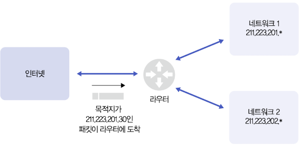

그림에서 왼쪽의 인터넷에서 임의의 호스트가 보낸 패킷이 라우터에 도착했다고 가정하자. 이 패킷의 목적지 주소가 221.223.201.30이므로 202.\*인 네트워크 2가 아닌 201.\*인 네트워크 1로 중계해야 한다. 이처럼 인터넷에서 IP 주소는 패킷의 경로를 결정하는 데 중요한 역할을 한다.

### 호스트 이름

특정 호스트에 연결하려면 반드시 해당 호스트의 IP 주소를 알아야 한다. 인터넷 내부의 네트워크 계층은 호스트를 IP 주소로 구분하기 때문이다. 하지만 일반 사용자들이 숫자로 된 IP 주소를 기억하기 힘들기 때문에, 문자로 된 호스트 이름을 사용한다.

아래 그림은 문자로 된 호스트 이름을 받아 IP 주소로 변환되는 과정이다.

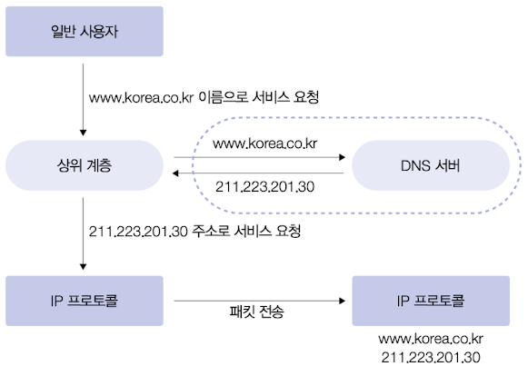

네트워크 계층의 IP 프로토콜은 호스트를 구분하는 용도로 IP 주소만 사용하기 때문에, 중간에서 문자로 된 호스트 이름을 변환해야 한다. 일반적으로 FTP, 텔넷과 같은 네트워크 응용 프로그램들이 실행 과정에서 사용자에게 호스트 이름을 명령어 인수로 입력받는다. 그 다음 가장 먼저 수행하는 작업으로 DNS(Domain Name System)라는 이름과 주소 변환 기능을 이용해서 IP 주소를 얻는다. 이후 변환된 IP 주소의 호스트에 연결 설정이나 전송 데이터가 포함된 패킷을 전송한다.

DNS 서비스는 호스트 이름을 <국가 도메인>, <단체 종류>, <단체 이름>, <호스트>라는 네 계층 구조로 나누고, 이들을 점(.)으로 구분해서 표기한다. <호스트>.<단체 이름>.<단체 종류>.<국가 도메인>으로, www.korea.co.kr이란 호스트 이름은 대한민국(kr)에 있는 일반 회사(co) 중에서 korea라는 이름의 회사에 소속된 www라는 호스트를 의미한다.

마지막 단계의 <호스트>는 소속 단체의 네트워크 관리자가 내부 규칙에 따라 개별 호스트에 부여한 이름을 사용한다.

## 03-2 주소 정보와 관리

호스트 이름과 IP 주소를 변환하는 간단한 방법은 특정 파일(예: UNIX 시스템의 /etc/hosts)에 호스트 이름과 IP 주소 조합을 기록해서 관리하는 것이다. 이런 경우라면 호스트 이름에 대응되는 IP 주소를 검색해서 변환하는 과정을 거치게 된다. 

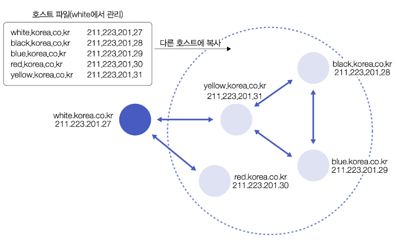

네트워크 관리자는 관리 대상이 되는 모든 호스트의 이름, 주소 정보를 주기적으로 갱신하고, 이 정보를 네트워크에 연결된 모든 호스트가 복사하게 함으로써 정보의 일관성을 유지한다.

하지만 잦은 변경이 일어나게 된 현재 인터넷 환경에서 DNS 서비스를 주로 이용하게 되었고, 이처럼 호스트 파일로 관리하는 방식은 보조적으로만 사용된다.

### DNS

호스트 파일로 주소와 이름 정보를 관리하는 것은 간단하지만, 대부분 수동으로 작업해야 한다는 단점이 있다. 

DNS(Domain Name System)이 이런 단점을 해결하기 위해 고안되었다. 주소와 이름 정보를 자동으로 유지하고 관리하는 분산 데이터 시스템이다. 호스트 주소와 이름 정보가 네임 서버(Name Server)라는 특정한 관리 호스트가 유지하고, 주소 변환 작업이 필요한 클라이언트는 네임 서버에 요청해서 IP 주소를 얻는다.

네트워크가 커지면 네임 서버에 보관되는 정보의 양도 자연스럽게 많아진다. DNS는 하나의 집중화된 네임 서버가 전체 호스트 정보를 관리하지 않고, 여러 네임 서버에 분산하여 관리하도록 설계되었다. 계층 구조로 연결된 네임 서버는 자신의 영역에 위치한 호스트 정보만 관리하는 방식이다. 정보를 상호 교환하면서 전체 호스트 정보를 일관성 있게 유지한다.

### 기타 주소

아래는 OSI 7계층 모델의 각 주소에서 사용되는 여러 주소의 특징들이다.

* MAC 주소

    계층 2의 MAC(Medium Access Protocol) 계층에서 사용하며, 일반적으로 **LAN 카드**에 내장되어 있다. 물리 계층을 통해 데이터를 전송할 때는 MAC 주소를 이용하여 호스트를 구분한다. 
    
    따라서 네트워크 계층이 하위 데이터 링크 계층에 데이터 전송을 요청하면, 먼저 IP 주소를 MAC 주소로 변환한다. 이후 MAC 계층이 상대 MAC 계층에 데이터를 전송할 수 있다.

* IP 주소

    네트워크 계층 기능을 수행하는 IP 프로토콜에서 사용된다. 수신자 IP 주소는 IP 패킷이 지나가는 경로를 결정하는 라우팅의 기준이 된다.

* 포트 주소

    포트 주소는(Port Address)는 전송 계층(4)에서 사용하며, 호스트에서 실행되는 프로세스를 구분해 준다. 인터넷에서 연결의 완성은 호스트와 호스트가 아닌, 네트워크 응용 프로세스와 네트워크 응용 프로세스 사이이다. 

    예를 들어, 내 스마트폰 메신저 앱과 상대 메신저 앱의 연결이 필요하다면, 하나의 IP 주소를 갖는 스마트폰에서 실행되는 **여러 네트워크 응용 앱을 구분하는 주소**가 바로 포트 주소이다.

    인터넷의 전송 계층 프로토콜인 TCP와 UDP가 독립적으로 포트 주소를 관리하며, 포트 번호 또는 소켓 주소라는 용어를 사용하기도 한다.

* 메일 주소

    메일 주소는 응용 계층의 메일 시스템에서 사용자를 구분하려고 사용한다. hong@co.kr처럼 사용자 이름과 호스트 이름을 @ 문자로 구분해서 표기한다.

---